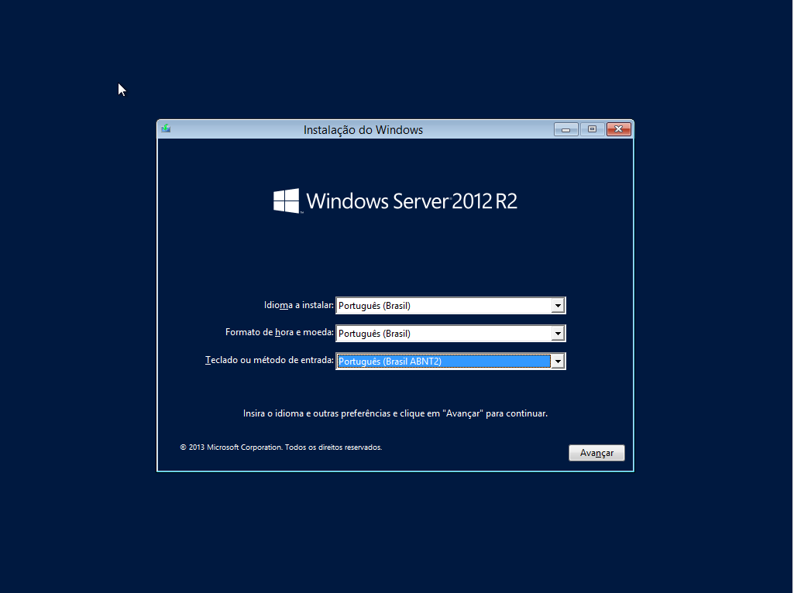
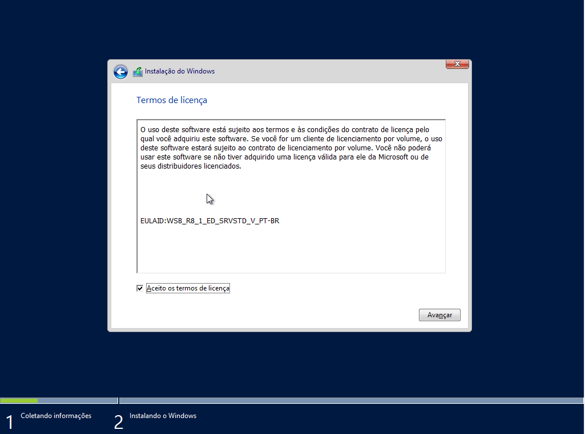
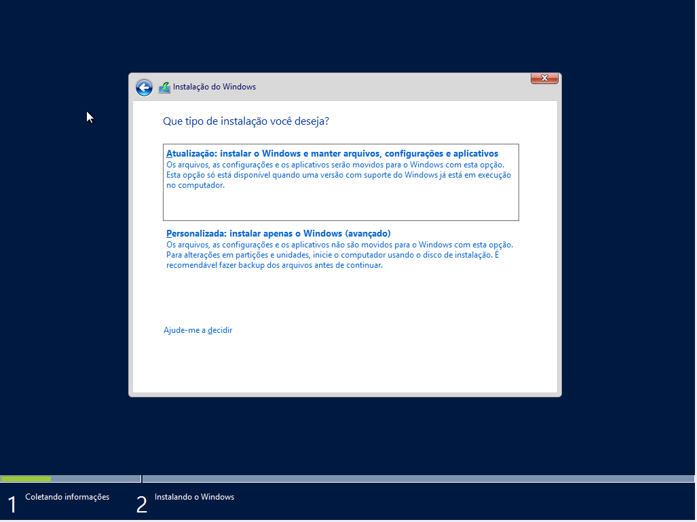
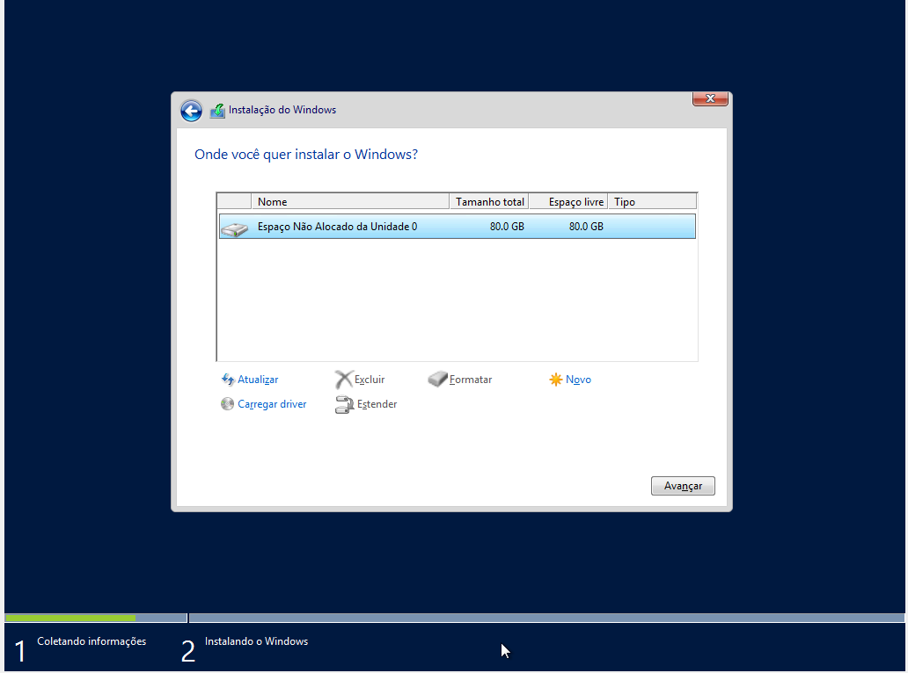
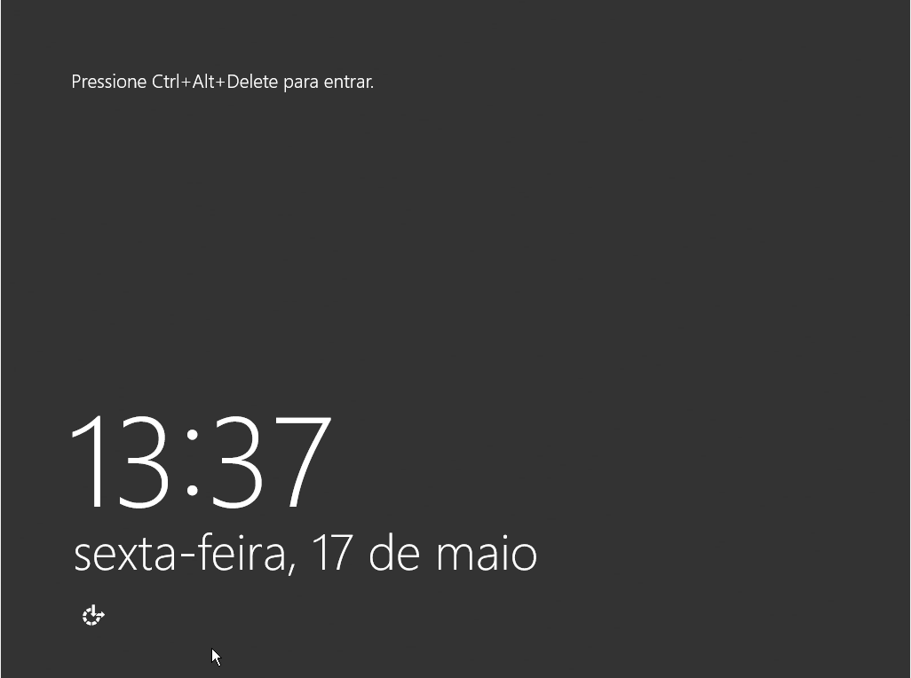
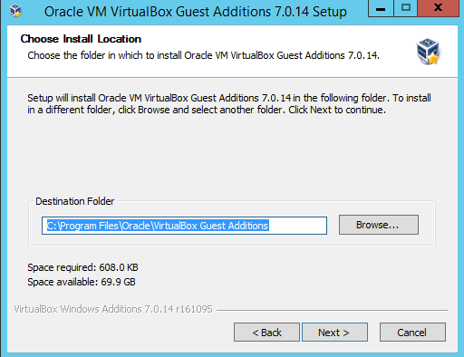
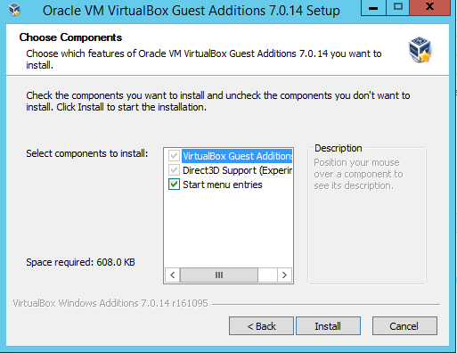
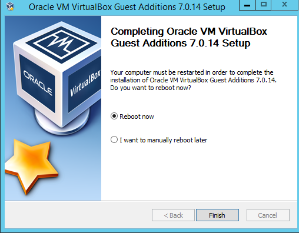
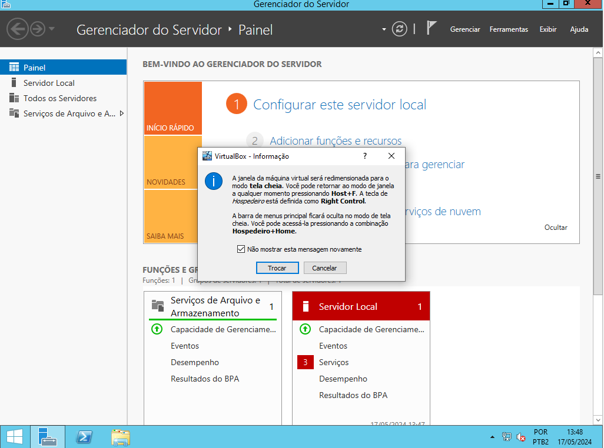

# **Windows Server 2012**
> ## Primeiramente escolha sua linguagem e o modelo do seu teclado:

> ## Então clique em instalar:

> ## Escolha o sistema operacional:

> ## Aceito os termos de licença:

> ## Clique em Instalação customizada:

> ## Clique em próximo:

> ## Clique Start:

> ## Entre na pasta:

> ## Accesse o virtual box CD drive:

> ## Acesse VBoxWindowsAdditions:

> ## Press Next:

> ## Next again:

> ## Press Instalar:

> ## Agora, instale:

> ## Clique em Finish

> ## Coloque sua senha:

> ## Clique no botão de mudar:
